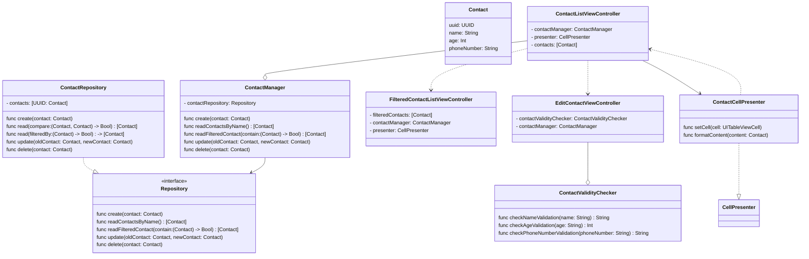

# 연락처 관리 프로젝트

## 팀원:busts_in_silhouette: 
| 프로필 사진 | <a href="https://github.com/newJunsung"></a> | <a href="https://github.com/bamsak"></a> |
| ---- | ----------- | --------- |
| in Github | [@newJunsung](https://github.com/newJunsung) | [@bamsak](https://github.com/bamsak) |
| in SeSAC | 뉴준성 | 밤삭 |

## 파일구조:file_folder:
- ios-contact-manager-ui
    - Presenters
        - ContactCellPresenter.swift
    - Protocols
        - CellPresenter.swift
        - ReuseIdentifiable.swift
        - Repository.swift
  - Extensions
      - Notification+Extension.swift
      - String+Extension.swift
  - Utility
     - ContactValidityChecker
  + Controller
     - ContactListViewController.swift
     - EditContactViewController.swift
     - FilterdContactViewController.swift
  + Model
     - Contact.swift
        - Contact
        - ContactManager
  - Exception
     - ContactEception
  + View
     + ContactCell

# UML:pencil:



## 새로 시도했던 점
### 다이나믹 타입 적용
스토리보드에서 각 라벨의 폰트 사이즈를 body로 하여 손쉬운 사용의 폰트 사이즈의 설정 값마다 앱 내의 폰트 사이즈가 달라지게 했습니다.
<p align="center">
    
  
  
</p>

### 검색 기능 추가
검색 바가 확성화 되어 있을 때만, 자신이 찾고 싶은 연락처가 보이게끔 만들었습니다.

```swift
private var filteredContacts = [Contact]()
private var isActive: Bool {
    navigationItem.searchController?.isActive ?? false
}
```

```swift
private func makeSearchBar() -> UISearchController {
    let searchController = UISearchController(searchResultsController: nil)
    searchController.obscuresBackgroundDuringPresentation = false
    searchController.searchResultsUpdater = self
    return searchController
}
```

```swift
func updateSearchResults(for searchController: UISearchController) {
    if let text = searchController.searchBar.text{
        filteredContacts = contactManager.contacts.filter { $0.name.localizedCaseInsensitiveContains(text) }
        tableView.reloadData()
    }
}
```

```swift
func tableView(_ tableView: UITableView, numberOfRowsInSection section: Int) -> Int {
    return isActive ? filteredContacts.count : contactManager.contacts.count
}

func tableView(_ tableView: UITableView, cellForRowAt indexPath: IndexPath) -> UITableViewCell {
    let id = "ContactCell"
    let contact = isActive ? filteredContacts[indexPath.row] : contactManager.contacts[indexPath.row]
    
    guard let cell = tableView.dequeueReusableCell(withIdentifier: id, for: indexPath) as? ContactCell else {
        let cell = ContactCell(style: .subtitle, reuseIdentifier: id)
        cell.configureCell(contact)
        return cell
    }
    cell.configureCell(contact)
    return cell
}
```

## 고민했던 점:interrobang:
[PR1](https://github.com/tasty-code/ios-contact-manager-ui/pull/22)

[PR2](https://github.com/tasty-code/ios-contact-manager-ui/pull/31)

[PR3](https://github.com/tasty-code/ios-contact-manager-ui/pull/39)
